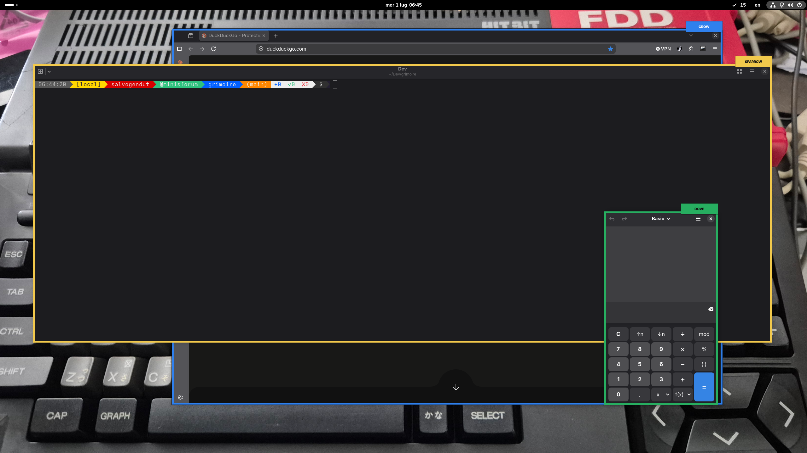
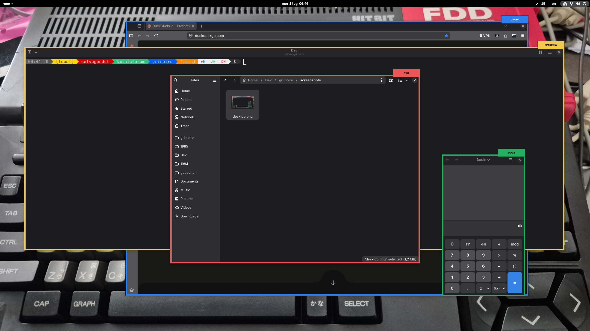
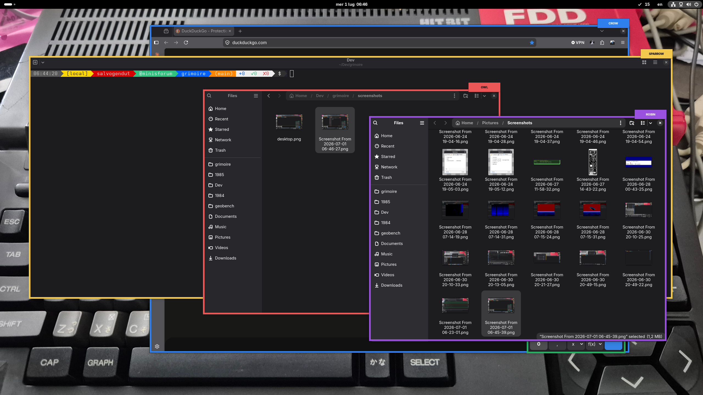

# Grimoire

Grimoire is an experimental GNOME-based voice control layer for Linux.
It does not replace Mutter or GNOME Shell. Instead, it adds a small GNOME
Shell extension that gives each visible window a colored frame and handle, then exposes
window actions over the session bus so a local voice daemon can execute
commands such as:

```text
focus yellow
focus sparrow
maximize blue
close green
open calculator
type make test
```

The current prototype covers focus/window management by color or bird handle,
application launching, and clipboard-paste dictation with terminal-aware Enter
handling. Window handles are remembered by app/title where possible, so a
reopened window can keep the same bird/color if that handle is still available.
The top GNOME bar shows a microphone status icon while the listener daemon is
heartbeating.

## Screenshots

<p>
  
  
</p>

<p>
  
</p>

## Current State

This repository currently contains:

- `extension/grimoire@salvogendut.github.io`: GNOME Shell extension skeleton
  for colored frames, bird-name tabs, and focus/window actions over DBus.
- `daemon/grimoired.py`: small command parser and dispatcher for local testing.
- `docs/architecture.md`: system design and major constraints.
- `docs/protocol.md`: the first DBus contract between the daemon and extension.

The code targets the local development machine's GNOME Shell 50.x APIs.

## Development

Install the extension into your local GNOME Shell extensions directory:

```sh
make install-extension
```

Then enable it:

```sh
make enable-extension
```

If enabling says the extension does not exist, run `make install-extension`
again with the updated Makefile. On Wayland, you may still need to log out and
back in after installing a new extension for the first time because GNOME Shell
does not always rescan extension metadata in a running session. During
development, inspect extension errors with:

```sh
journalctl --user -f /usr/bin/gnome-shell
```

Once enabled, try the parser without touching DBus:

```sh
python3 daemon/grimoired.py --dry-run --command "focus yellow"
```

If the extension is running, send a command to GNOME Shell:

```sh
python3 daemon/grimoired.py --command "focus yellow"
```

List the windows known to the extension:

```sh
python3 daemon/grimoired.py --list-windows
```

List launchable apps known to the extension:

```sh
python3 daemon/grimoired.py --list-apps
```

Open an application by voice-style command text:

```sh
python3 daemon/grimoired.py --command "open calculator"
```

Ask for the current visible handles or launchable applications:

```sh
python3 daemon/grimoired.py --command "list windows"
python3 daemon/grimoired.py --command "show apps"
```

Deliberately clear remembered handle assignments and reassign current windows:

```sh
python3 daemon/grimoired.py --command "refresh handles"
```

Run the current tests:

```sh
make test
```

## Voice Prototype

The first voice path uses a local `whisper.cpp` install if present at:

```text
/var/home/salvogendut/Dev/whisper.cpp/build/bin/whisper-cli
/var/home/salvogendut/Dev/whisper.cpp/models/ggml-base.en.bin
```

Check which recognizer binary and model Grimoire will use:

```sh
make check-asr
```

Transcribe an existing WAV without executing anything:

```sh
python3 daemon/grimoired.py --audio-file /path/to/audio.wav
```

Record one short microphone utterance and parse it without executing:

```sh
python3 daemon/grimoired.py --listen --record-seconds 3
```

Run an Enter-to-record command loop:

```sh
python3 daemon/grimoired.py --listen-loop --record-seconds 3
```

In loop mode, press Enter to record one command and type `q` then Enter to
quit. When `--execute-listen` is set and execution is armed, non-destructive
window commands execute immediately. Destructive commands such as
`close sparrow` require confirmation. Use `--dry-run` with `--listen-loop` to
transcribe and parse without executing.

The daemon prints a compact trace while parsing and executing commands:

```text
heard: "type dove git status enter"
parsed: dictate target=dove text="git status enter"
action: focus dove -> ok
action: paste "git status" -> ok
action: press enter -> ok
```

Pass `--quiet` to suppress the trace.

Dictation uses the focused window. Say `type hello world` to paste text into
the active app. Common terminal words are normalized before paste, for example
`type ls minus la enter` pastes `ls -la` and then presses Enter.

Dictation can also target a window handle directly. Say
`type dove git status enter` or `dictate to crow hello world` to focus that
window before pasting.

Only execute listened commands when you explicitly opt in:

```sh
python3 daemon/grimoired.py --listen --record-seconds 3 --execute-listen
```

Run the non-interactive service loop used by the systemd user unit:

```sh
python3 daemon/grimoired.py --listen-service --execute-listen --record-seconds 3
```

While `--listen-loop` or `--listen-service` is running, the daemon sends a
heartbeat to the GNOME Shell extension. The top-bar icon shows the current
state:

- Gray: daemon inactive.
- `OFF` in yellow: daemon idle or blocked with execution disabled.
- `ON` in green: daemon idle and armed for execution.
- `REC` in red: recording from the microphone.
- `ASR` in blue: transcribing with the speech recognizer.
- `PAR` in cyan: parsing the transcript.
- `OK` in green: a command was recognized.
- `RUN` in green: executing a command.
- `ERR` in red: an error occurred.

Click the icon, or press `Ctrl+Alt+Space`, to toggle between yellow and green.
The daemon checks this armed state immediately before dispatching a listened
command.

The same execution gate can be inspected or changed from the terminal:

```sh
make execution-mode
make arm-execution
make disarm-execution
```

The default shortcut is stored in the extension's `toggle-execution` setting.
For a local development install, change it with:

```sh
gsettings \
  --schemadir ~/.local/share/gnome-shell/extensions/grimoire@salvogendut.github.io/schemas \
  set org.grimoire toggle-execution "['<Control><Alt>space']"
```

When installed as a user service, common service controls are available:

```sh
make install-user-env
make reload-daemon
make start-daemon
make stop-daemon
make status-daemon
make logs-daemon
```

You can override the recognizer with an ASR command template:

```sh
python3 daemon/grimoired.py --audio-file sample.wav --asr-command "my-asr {audio}"
```

## AI Interpreter

Grimoire can optionally send a transcript through an AI interpreter before
execution. The AI layer is not an executor: it can only return a structured
intent, and the daemon validates that intent against the local allowlist of
actions and handles before dispatching anything.

Modes:

- `off`: deterministic parser only.
- `fallback`: use AI only when the deterministic parser does not understand the
  transcript.
- `validate`: ask AI to validate/normalize even when the deterministic parser
  succeeds.

Try it without executing:

```sh
python3 daemon/grimoired.py --command "put dove away" --ai-dry-run
```

Enable fallback mode for a command:

```sh
python3 daemon/grimoired.py --command "put dove away" --ai --dry-run
```

Check AI configuration:

```sh
make check-ai
```

Configure a provider interactively:

```sh
make setup-ai
```

The wizard asks which provider to use and stores the result in
`~/.config/grimoire/grimoired.env` (created with mode 0600):

- `claude-code`: Anthropic models through your existing Claude Code login. No
  API key is handled by Grimoire; the daemon shells out to the `claude` CLI,
  which owns authentication. If you have never signed in, run `claude` once
  and it walks you through the browser sign-in. Slower per command than the
  direct APIs because it spawns the CLI, but there is nothing to configure.
- `anthropic`: the Anthropic Messages API with an `ANTHROPIC_API_KEY`. The
  wizard offers to open the key console in your browser and reads the pasted
  key without echoing it.
- `openai`: OpenAI's Responses API with an `OPENAI_API_KEY`, same key flow.

Neither Anthropic nor OpenAI currently offers a browser OAuth flow that
third-party applications may use, so API providers need a pasted key; the
`claude-code` provider is the no-key path.

Manual configuration uses the same variables the wizard writes:

```sh
GRIMOIRE_AI_PROVIDER=openai|anthropic|claude-code
GRIMOIRE_AI_MODE=fallback
OPENAI_API_KEY=...            # openai
GRIMOIRE_OPENAI_MODEL=gpt-4o-mini
ANTHROPIC_API_KEY=...         # anthropic
GRIMOIRE_ANTHROPIC_MODEL=claude-haiku-4-5-20251001
GRIMOIRE_CLAUDE_CLI=...       # claude-code, defaults to 'claude' on PATH
GRIMOIRE_CLAUDE_MODEL=...     # claude-code, defaults to the CLI's model
```

`OPENAI_BASE_URL` and `ANTHROPIC_BASE_URL` must use HTTPS unless they point to
localhost. This protects the transcript in transit, but it is not end-to-end
encryption: a cloud model must receive the transcript in readable form to
interpret it. Grimoire sends only minimal context by default: transcript,
allowed actions, allowed handles, and deterministic parser output. It does not
send screenshots or window titles. Whatever the provider returns is validated
against the local allowlists before anything executes.

For service installs, put recognizer, AI, and service argument overrides in:

```text
~/.config/grimoire/grimoired.env
```

The RPM installs an example at:

```text
/usr/share/grimoire/grimoired.env.example
```

Create your user config from it (or let `grimoired --setup-ai` create it):

```sh
mkdir -p ~/.config/grimoire
cp /usr/share/grimoire/grimoired.env.example ~/.config/grimoire/grimoired.env
```

Example values:

```sh
GRIMOIRE_DAEMON_ARGS="--listen-service --execute-listen --record-seconds 3"
GRIMOIRE_WHISPER_CLI=/usr/bin/whisper-cli
GRIMOIRE_WHISPER_MODEL=/home/salvogendut/.local/share/grimoire/models/ggml-base.en.bin
GRIMOIRE_AI_PROVIDER=anthropic
ANTHROPIC_API_KEY=...
GRIMOIRE_AI_MODE=fallback
GRIMOIRE_ANTHROPIC_MODEL=claude-haiku-4-5-20251001
```

After editing the file, reload and restart the user service:

```sh
systemctl --user daemon-reload
systemctl --user restart grimoired.service
```

## Packaging

The repository has a plain install target and a first Fedora RPM spec. The
package layout is:

- `/usr/share/gnome-shell/extensions/grimoire@salvogendut.github.io`: GNOME
  Shell extension.
- `/usr/bin/grimoired`: daemon command wrapper.
- `/usr/libexec/grimoire`: Python daemon implementation.
- `/usr/lib/systemd/user/grimoired.service`: disabled user service.

Build a source archive and RPM locally:

```sh
make dist
make rpm
```

After installing the RPM, enable the extension and start the daemon service:

```sh
gnome-extensions enable grimoire@salvogendut.github.io
systemctl --user enable --now grimoired.service
```

Check the installed recognizer setup:

```sh
grimoired --check-asr
```

The service is intentionally not enabled by default. When running, it starts
disarmed: it can prove the microphone, recognizer, heartbeat, and status icon
path without executing background speech. Click the top-bar icon to arm
execution for the current daemon session.

## Design Direction

Grimoire has three cooperating layers:

1. GNOME Shell extension: colored frames, window inventory, focus, close,
   minimize, maximize, fullscreen.
2. Voice daemon: microphone capture, speech recognition, command parsing, and
   dispatch.
3. Input executor: dictation and keyboard/paste events through a Wayland-safe
   path such as xdg-desktop-portal RemoteDesktop/EIS or an accessibility route
   where appropriate.

See [docs/architecture.md](docs/architecture.md) for details.
